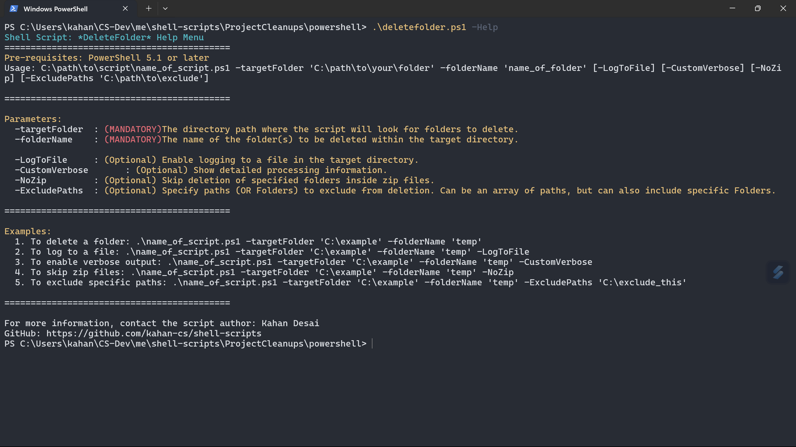

# 🛠️ Shell Scripts for Automating My CS Chores

> **Note:** While I have not actively maintained this repository, this script remains unchanged.  
> My shell scripts have since evolved across multiple projects, integrating broader automation and management solutions.


## 🚀 How to Run the DeleteFolder Script
1. **Download** the script into a designated folder.
2. **Open** a PowerShell terminal in that folder.
3. **Execute** the script using the following command:

   ```powershell
   .\name_of_script.ps1 -targetFolder 'C:\path\to\your\folder' -folderName 'name_of_folder' [-LogToFile] [-CustomVerbose] [-NoZip] [-ExcludePaths 'C:\path\to\exclude']
   ```
>*To view all available parameters and their usage, you can use the '-Help' command:*

   ```powershell
   .\deletefolder.ps1 -Help
   ```

### Notes:
- If you do not use mandatory parameters (`targetFolder` or `folderName`), the script will prompt you to provide them.

## 📸 Help Command Output



## 📜 Latest Modifications:
- Enhanced logging functionality to keep track of deleted folders and actions taken.
- Added verbose mode for detailed output during script execution.
- Created user prompts for confirmation and improved user experience.
- Implemented the ability to skip deletion inside zip files and exclude specified paths.
- Added a help command to display usage instructions and available parameters.

## 🔧 In Progress:
- Developing **Bash** versions of the scripts.
- Simplifying execution by creating **.exe** files.
- Designing a **GUI** for direct handling of the executable using Windows Forms or WPF.

## 🌟 Future Goals:
- Creating additional scripts for organizing course folders every semester.
- Custom scripting for improved efficiency in managing coursework and related files.
